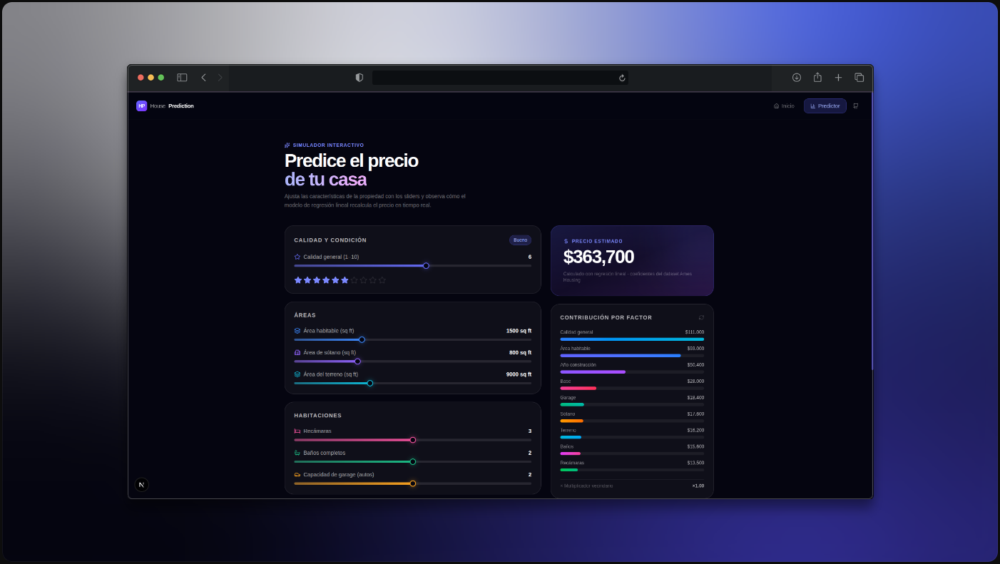

# House Price Prediction

A supervised machine learning project that predicts residential property sale prices using the Ames Housing dataset. The pipeline covers exploratory data analysis, feature engineering, model training with linear regression, and evaluation using standard regression metrics.



---

## Overview

The Ames Housing dataset contains 1,460 training observations and 79 features describing residential properties in Ames, Iowa. The goal is to build a regression model that accurately estimates the final sale price (`SalePrice`) based on those features.

This project was built as a practical exercise in the end-to-end data science workflow: from raw data to a deployable prediction interface.

---

## Dataset

| Split       | Records |
|-------------|---------|
| Training    | 1,460   |
| Test        | 1,459   |
| Features    | 79      |

Key feature groups:

- **Numerical**: lot area, living area, basement area, year built, number of bathrooms and bedrooms.
- **Categorical**: neighborhood, zoning classification, roof style, garage type, overall quality rating.
- **Target**: `SalePrice` — the final sale price in USD.

---

## Pipeline

1. **Data loading** — CSV ingestion and initial schema inspection.
2. **Exploratory Data Analysis (EDA)** — distribution analysis, correlation heatmaps, and outlier detection.
3. **Preprocessing** — missing value imputation, categorical encoding, and numerical normalization.
4. **Feature engineering** — selection and transformation of the most predictive variables.
5. **Model training** — linear regression via scikit-learn with K-Fold cross-validation.
6. **Evaluation** — RMSE and R² score computation on the validation set.
7. **Visualization** — matplotlib and seaborn plots for residual analysis and prediction distribution.

---

## Requirements

- Python 3.8 or higher
- Jupyter Notebook

Install all dependencies:

```sh
pip install -r requirements.txt
```

Core libraries used:

| Library      | Purpose                          |
|--------------|----------------------------------|
| pandas       | Data manipulation                |
| numpy        | Numerical computing              |
| scikit-learn | Modeling, preprocessing, metrics |
| matplotlib   | Static visualizations            |
| seaborn      | Statistical plots                |

---

## Project structure

```
Houses-Prices-Prediction/
├── Final_Project.ipynb        # Main notebook with the full pipeline
├── house-prices/
│   ├── house_prices.csv       # Training data
│   ├── test.csv               # Test data
│   └── data_description.txt   # Feature documentation
├── house-prices-web/          # Next.js presentation site with interactive predictor
└── README.md
```

---

## Interactive web interface

The `house-prices-web/` directory contains a Next.js application that presents the project and includes a live price predictor. Adjust property features with sliders and see how the regression model updates the estimated price in real time.

To run it locally:

```sh
cd house-prices-web
npm install
npm run dev
```

---

## Author

Diego Villagran

<a href="https://linkedin.com/in/dvillagrans" target="_blank">

</a>
&nbsp;
<a href="https://github.com/dvillagrans" target="_blank">

</a>
